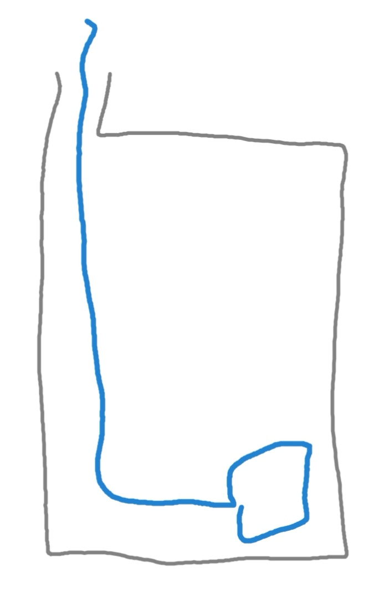
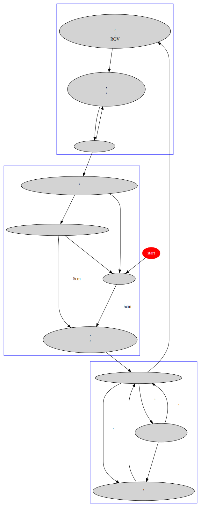

# ResDet

## TODO

1. 解决启用UART时输出不只换行不回车问题
2. 屏蔽**invalid ue golomb code**错误

## 需要注意的问题

- 抓取范围半径约10cm
- 抓手抓取一次大致耗时18s
- 深度传感器以开启时压强校零, 因此要在下水前开机才能测得水的绝对高度.
- 深度传感器记录的是压强, 当工作水域密度和传感器内置密度不同时传感器给出的深度不准

   解决办法: 现场测量定量水的重量得出修正参数.

   $$\rho_{sea}g_{local}V=k\rho_0g_0V$$
   $$k=\frac{G_{sea}}{G_{standard}}$$
   $$h=\frac{h}{k}'$$

🔗[海水密度参考资料](doc/海水密度.png)

- 移动时深度传感器数据变化剧烈, 可以考虑制作如下整流罩 (灰色), 能极大减小水流干扰

- ROV开启后TCP通信只能连接一次
- 通过TCP和ROV通信只发一次指令似乎可能收不到, 保险一点最好多次发送
- 软体臂在ROV转动时易被甩起干扰摄像头视野, 甚至可能被识别为目标. 不过在平动时甩动较小
- 因为没有加速度传感器, 无法保证水平方向的完全静止, 如果不在下潜过程中实时调整水
  平坐标始终无法保证坐底后目标仍在可抓范围内. 不过我认为这不是大问题, ROV的误差
  应当由软体臂的抓取范围来容错.

## 自主抓取

### 2019目标

三十分钟内能抓到一个目标就nb

### 程序逻辑

### 水域分析

所谓自然水域其实就在海洋牧场旁边, 并不怎么自然

水底其实较为平坦, 我看到最大的海沟基本就以下两处

我感觉扇贝特别多, 海星第二多, 海胆不多, 海参基本没有

👇 海胆, 海参, 海星

总的来说基本随便找个地方坐底视野里也有几个扇贝, 有的地方甚至可抓范围内就有好几个
可以抓的扇贝, 不过水底水草较多, 虽然我们假设螺旋桨不会被缠住, 但抓取时很有可能受水草干扰抓不起扇贝, 也许应该设置一个同一目标抓取次数阈值, 抓不住就换一个.

👇 几个坐底时的画面

## TCP_Server类

### 成员函数

|函数名|功能|
|-|-|
|(构造函数)|创建监听socket, 绑定端口并开始监听端口|
|(析构函数)|关闭业务socket, 关闭监听socket|
|**void recvMsg( void )**|如果未建立业务socket则在accept()处阻塞, 直到建立业务socket. 接收ROV发来的24位数据并处理第4位 (舱1是否漏水, 存至 `isOneLeak`), 第7位 (舱2是否漏水, 存至 `isTwoLeak`), 第8, 9位 (深度信息, 存至 `depth`)数据.|
|**void sendMsg( int move )**|按传递的参数`move`对应的动作 (见下表) 发送指令给ROV|

⚠️ accept()在 **recvMsg()** 中意味着必须先执行一次recvMsg()才能和ROV建立连接.

另外值得注意的是**accept()**和**recv()**在未接收到ROV数据时会一直等待, 即阻塞, 直到接收到数据程序才会继续.

### sendMsg()中move值与动作与可用宏定义对应表

|动作|move的值|宏定义名|
|-|-|-|
|开灯|SEND_LIGHTS_ON|0|
|全速前进|SEND_FORWARD|1|
|全速后退|SEND_BACKWARD|2|
|全速左|SEND_LEFT|3|
|全速右|SEND_RIGHT|4|
|全速左转|SEND_TURN_LEFT|5|
|全速右转|SEND_TURN_RIGHT|6|
|全速上升|SEND_UP|7|
|全速下降|SEND_DOWN|8|
|半速前进|SEND_HALF_FORWARD|9|
|半速后退|SEND_HALF_BACKWARD|10|
|半速左|SEND_HALF_LEFT|11|
|半速右|SEND_HALF_RIGHT|12|
|半速左转|SEND_HALF_TURN_LEFT|13|
|半速右转|SEND_HALF_TURN_RIGHT|14|
|半速上升|SEND_HALF_UP|15|
|半速下降|SEND_HALF_DOWN|16|
|无动作|SEND_SLEEP|17|
|向前微调|SEND_ADJUST_FORWARD|18|
|向后微调|SEND_ADJUST_BACKWARD|19|
|向左微调|SEND_ADJUST_LEFT|20|
|向右微调|SEND_ADJUST_RIGHT|21|
|微左转|SEND_ADJUST_TURN_LEFT|22|
|微右转|SEND_ADJUST_TURN_RIGHT|23|

