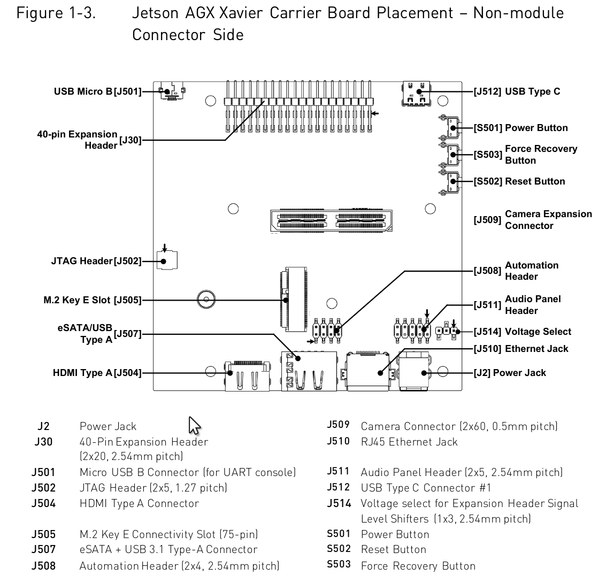

- [Jetson下载中心](https://developer.nvidia.com/zh-cn/embedded/downloads)
- [SDK Manager向Jetson安装JetPack教程](https://docs.nvidia.com/sdk-manager/install-with-sdkm-jetson/index.html)
- [NVIDIA Jetson Linux Developer Guide](https://docs.nvidia.com/jetson/l4t/index.html)
- [Jetson软件历史版本列表](https://docs.nvidia.com/jetson/archives/index.html)
- [Jetson储存空间已满, 无法进入图形界面解决办法](https://blog.csdn.net/abc869788668/article/details/78289716?utm_medium=distribute.pc_relevant_t0.none-task-blog-2%7Edefault%7EBlogCommendFromMachineLearnPai2%7Edefault-1.control&dist_request_id=1328760.1863.16171900380303395&depth_1-utm_source=distribute.pc_relevant_t0.none-task-blog-2%7Edefault%7EBlogCommendFromMachineLearnPai2%7Edefault-1.control)
- [N卡算力表](https://developer.nvidia.com/cuda-gpus#compute)
- [Jetson AGX Xavier载板布局](https://docs.nvidia.com/jetson/l4t/Tegra%20Linux%20Driver%20Package%20Development%20Guide/hw_setup.html#wwpID0E0NP0HA)

## 硬件配置

### 上电自启



短接`J508`的引脚5, 引脚6可以实现上电自启动系统. 详见 📑[NVIDIA Jetson AGX Xavier Developer Kit Carrier Board Specification第3章第5节](./Jetson_AGX_Xavier_Developer_Kit_Carrier_Board_Specification_SP-09778-001_v2.1.pdf#%5B%7B%22num%22%3A289%2C%22gen%22%3A0%7D%2C%7B%22name%22%3A%22XYZ%22%7D%2C81%2C720%2C0%5D).

### 40pin引脚配置

📑 [Configuring the 40-Pin Expansion Header](https://docs.nvidia.com/jetson/l4t/Tegra%20Linux%20Driver%20Package%20Development%20Guide/hw_setup_jetson_io.html#)

运行`sudo /opt/nvidia/jetson-io/jetson-io.py`可以打开Jetson-IO配置工具. 在Jetson AGX Xavier的32.3.1版L4T中有bug, 用`sudo find /opt/nvidia/jetson-io/ -mindepth 1 -maxdepth 1 -type d -exec touch {}/__init__.py \;`修复.

## 驱动配置

### I2C舵机驱动板

📑 [树莓派Jetson16路I2C舵机驱动板](树莓派Jetson16路I2C舵机驱动板.md)

💡上图中`J30`右上有箭头的引脚为pin1

```shell
sudo apt-get install -y python3-smbus  # I2C库

sudo groupadd -f -r gpio
sudo usermod -a -G gpio $USER  # 将当前用户加入gpio组
sudo -H pip install --upgrade Jetson.GPIO
sudo cp /usr/local/lib/python3.6/dist-packages/Jetson/GPIO/99-gpio.rules /etc/udev/rules.d/
sudo udevadm control --reload-rules && sudo udevadm trigger
```

## 软件配置

### 项目环境配置

用NVIDIA SDK Manager把JetPack4.3安到Jetson上 (JetPack4.3包含的cuda为cuda10.0)

```shell
# 读本地摄像头的依赖
sudo apt install vlc-utils v4lucp
```

#### OpenCV3.4 (cuda10.0)编译

```shell
# Install dependencies based on the Jetson Installing OpenCV Guide
sudo apt-get install build-essential make cmake cmake-curses-gui \
                       g++ libavformat-dev libavutil-dev \
                       libswscale-dev libv4l-dev libeigen3-dev \
                       libglew-dev libgtk2.0-dev
# Install dependencies for gstreamer stuffs
sudo apt-get install libdc1394-22-dev libxine2-dev \
                       libgstreamer1.0-dev \
                       libgstreamer-plugins-base1.0-dev
# Install additional dependencies
sudo apt-get install libjpeg-dev libjpeg-turbo8-dev libtiff-dev libavcodec-dev
sudo apt-get install libxvidcore-dev libx264-dev libgtk-3-dev \
                       libatlas-base-dev gfortran
sudo apt-get install libopenblas-dev liblapack-dev liblapacke-dev
# 缺失cublas device库的糊弄办法
# 问题原因: https://forums.developer.nvidia.com/t/cuda-blas-libraries-not-installed/107908
sudo ln -s /usr/local/cuda-10.0/lib64/libcublas.so /usr/local/cuda-10.0/lib64/libcublas_device.so
# 删除JetPack安装的opencv4,避免gstreamer出问题 (指无法读取本地摄像头)
sudo rm -rf /usr/include/opencv4

# 减少不必要的编译, 开启一些加速的模块
cmake \
-D CMAKE_BUILD_TYPE=Release \
-D OPENCV_EXTRA_MODULES_PATH=../../opencv_contrib-3.4.11/modules \
-D BUILD_opencv_python=OFF \
-D BUILD_opencv_python_bindings_generator=OFF \
-D PYTHON2_EXECUTABLE:FILEPATH= \
-D PYTHON3_EXECUTABLE:FILEPATH= \
-D WITH_CUDA=ON \
-D CUDA_NVCC_FLAGS="-D FORCE_INLINES" \
-D OPENCV_DNN_CUDA=ON \
-D ENABLE_FAST_MATH=ON \
-D CUDA_FAST_MATH=ON \
-D WITH_LIBV4L=ON \
-D BUILD_TESTS=OFF \
-D BUILD_PERF_TESTS=OFF \
-D BUILD_EXAMPLES=OFF \
-D WITH_PROTOBUF=OFF \
-D WITH_GTK=ON \..

sudo make -j 18
sudo make install
```

然后不知为何make的过程中没有自动将`libopencv_features2d.so.3.4`更新给ld, 需要手动操作一下

```shell
sudo touch /etc/ld.so.conf.d/opencv.conf
sudo echo "/usr/local/lib" > /etc/ld.so.conf.d/opencv.conf
sudo ldconfig -v
```

#### libtorch

[安装指定版本pytorch](https://forums.developer.nvidia.com/t/pytorch-for-jetson-version-1-8-0-now-available/72048)

编译使用libtorch的程序的方式参考[在Jetson NANO上使用libtorch进行C++模型推理以及编译OpenCV](https://blog.csdn.net/qizhen816/article/details/103566646)

```shell
sudo pip3 install cpython
pip3 install torch-1.1.0-cp36-cp36m-linux_aarch64.1.whl
```


### Jetson调整

```shell
# 查看磁盘空间使用情况
df -h
# 降序查看当前目录下各文件夹/文件大小
du -sh * | sort -rh
# 安装jtop
sudo apt install python3-dev python3-pip
sudo -H pip3 install jetson-stats
# 开最大性能, 将CPU, GPU, EMC频率拉满
sudo jetson_clocks
# 开最大频率模式 (看起来这个功率低频率高的是性能最高的)
sudo nvpmodel -m 0
```

### 设置静态IP

新建`/etc/network/interfaces.d/eth0`:
```shell
auto eth0
iface eth0 inet static
address 192.168.1.112
netmask 255.255.255.0
gateway 192.168.1.1
```

💡 也可以在项目根目录执行`./config/config ip rov`生成该配置文件

重启后生效, 网线直连时Jetson的IP为`192.168.1.112`. 注意网线直连时上位机ip也需要在`192.168.1.x`段.

### TensorRT加速Torch模型

https://zhuanlan.zhihu.com/p/88318324

https://github.com/NVIDIA-AI-IOT/torch2trt
