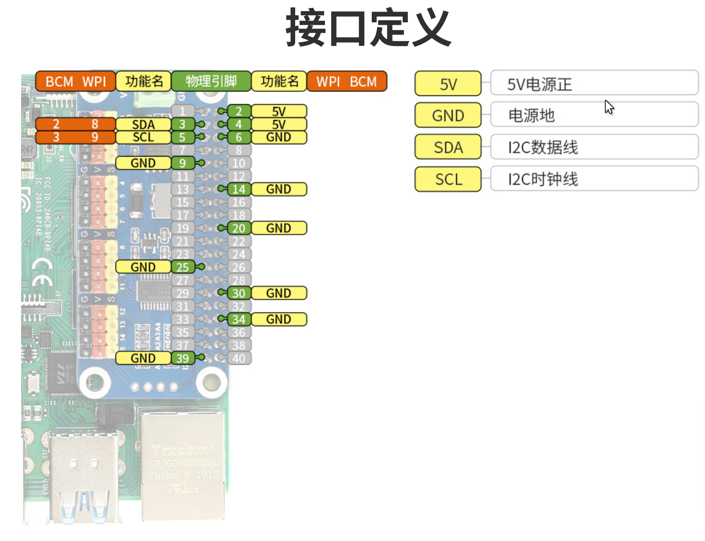

📑 [产品链接](https://www.waveshare.net/shop/Servo-Driver-HAT.htm) 

| 项目     | 参数                               |
| -------- | ---------------------------------- |
| VCC      | 5V                                 |
| 逻辑电压 | 3.3V                               |
| 输出     | 16路舵机/PWM输出, 每路4096级分辨率 |

