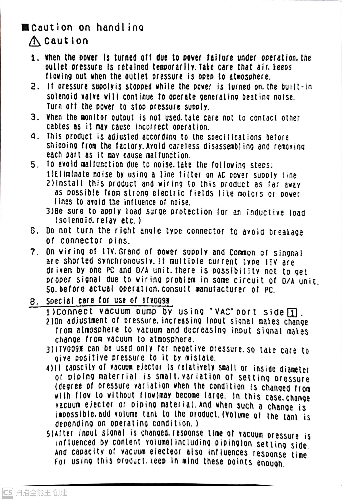

| item                           | value                |
| ------------------------------ | -------------------- |
| Power Supply                   | 24V±10%              |
| Input Signal (ITV0030-**2**BL) | 0-5V Analog Voltage  |
| Input Signal (ITV0030-**3**BL) | 0-10V Analog Voltage |
| Pressure range                 | 0.5MPa               |

## 说明书摘要

